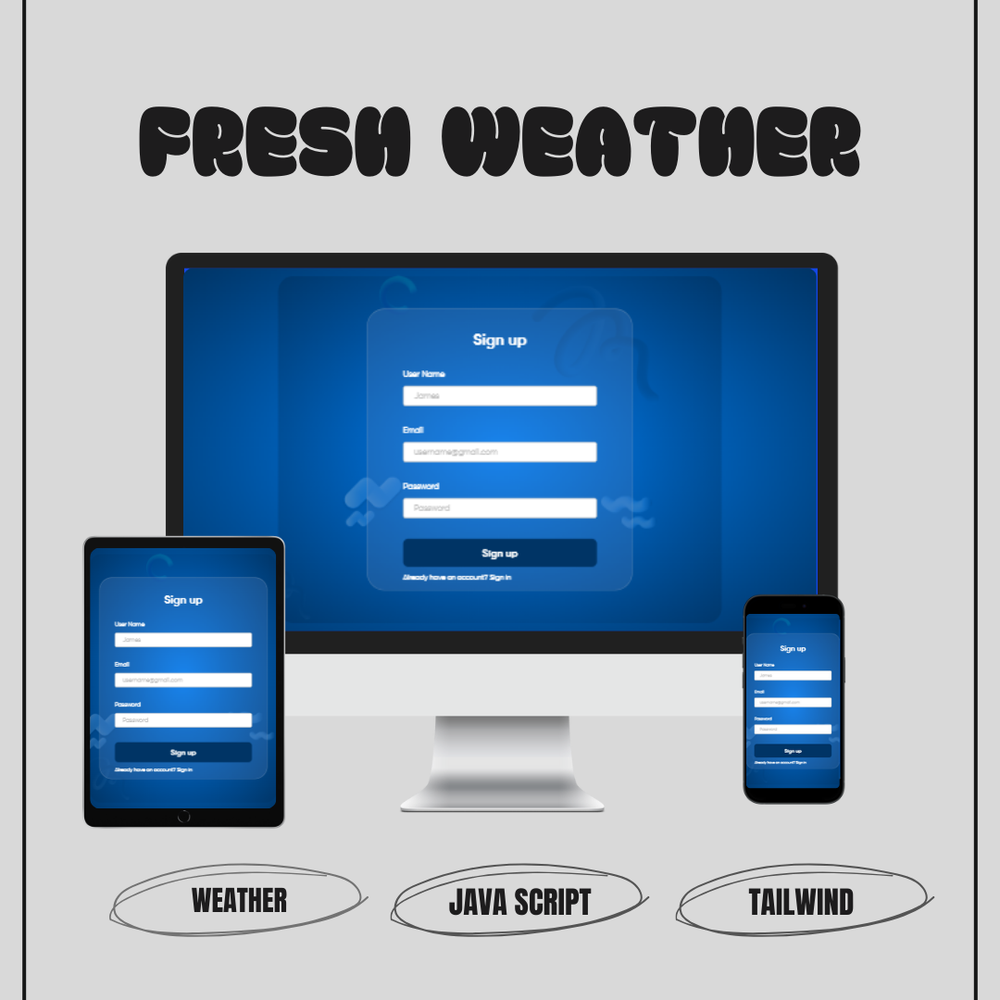
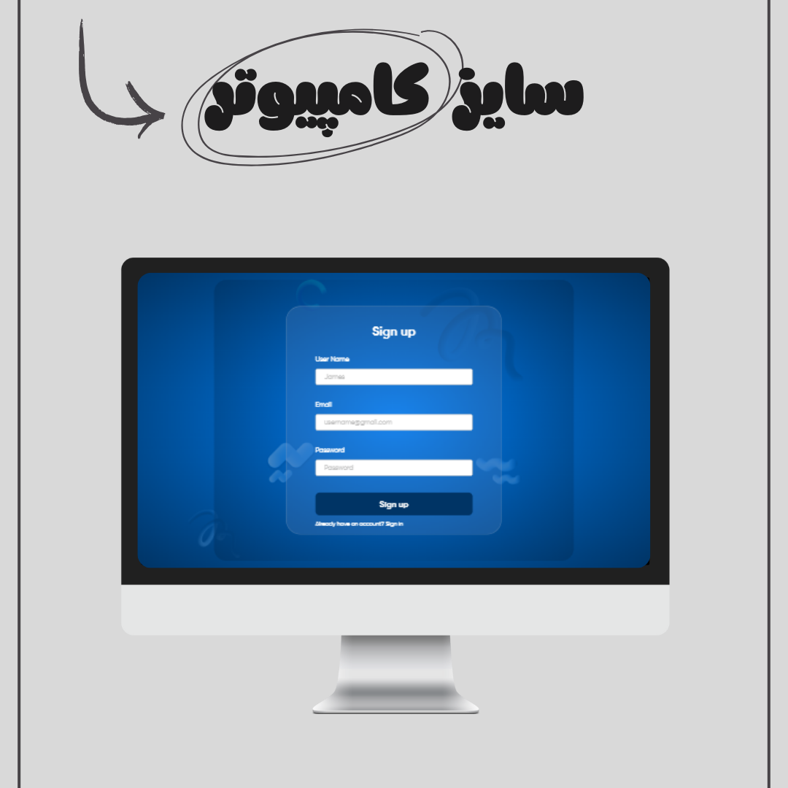
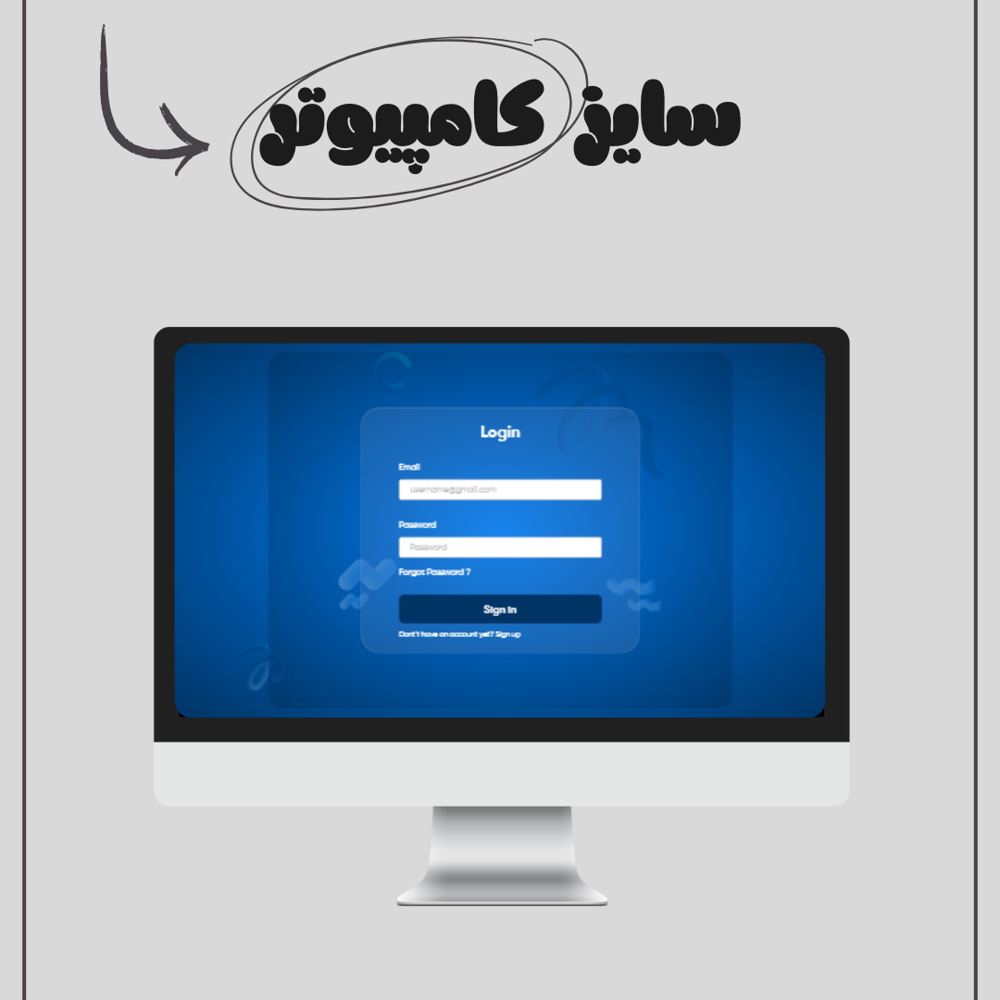
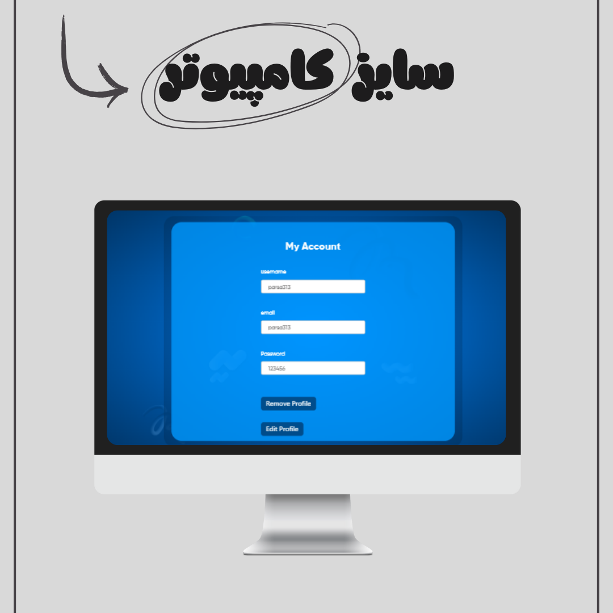
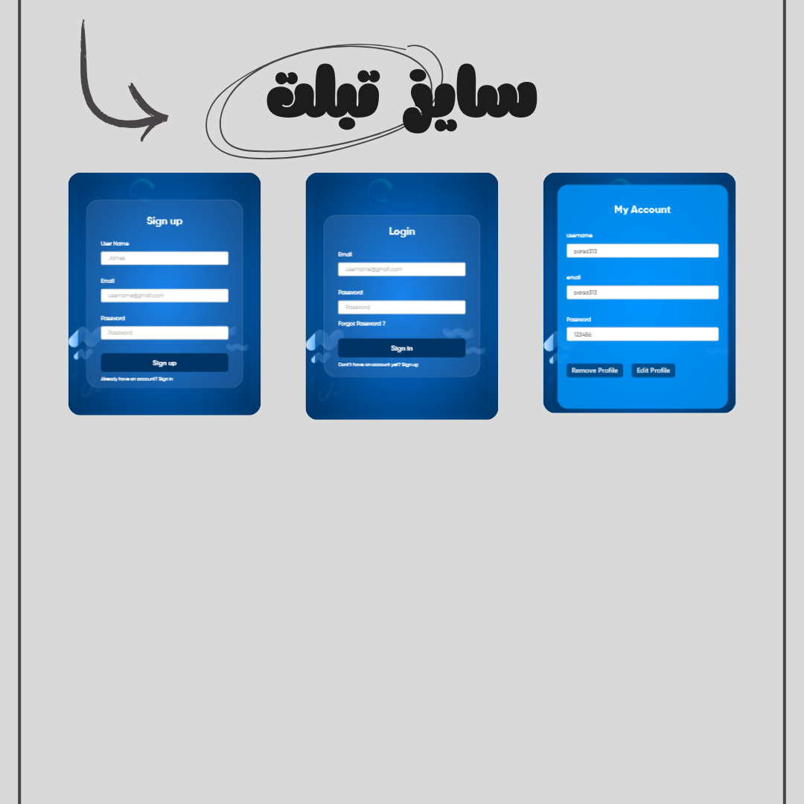

# 🔐 Fresh Auth & CRUD App

A **modern, responsive authentication and CRUD app** built with **Tailwind CSS and JavaScript**.  
Users can register, log in, and manage their data with a simple and intuitive interface.

---

## 🌐 Live Demo

[View Live Demo](https://parsa-farshah.github.io/log-in-CRUD/)

---

## ✨ Features

- 🔑 **Login / Signup** — User authentication with registration and login forms
- 📝 **CRUD Operations** — Create, Read, Update, Delete user data
- 🗂️ **Data Management** — Easily edit or remove user entries
- 🌐 **MockAPI Integration** — Simulated backend with **MockAPI**
- 📱 **Fully Responsive** — Works seamlessly on desktop, tablet, and mobile

---

## 🛠️ Technologies Used

- **Tailwind CSS** — Responsive and modern UI
- **JavaScript (Vanilla JS)** — Dynamic frontend interactions
- **MockAPI** — Backend simulation for user data

---

## 💻 Pages

1. **Login Page** — User login form
2. **Signup Page** — User registration form
3. **Dashboard / Home** — Display user data
4. **Add Data Page** — Form to create new entries
5. **Edit Data Page** — Edit existing entries
6. **Delete Data** — Remove unwanted entries

---

# 🔐 پروژه احراز هویت و مدیریت داده‌ها (Fresh Auth & CRUD App)

یک **اپلیکیشن مدرن و ریسپانسیو** برای ثبت نام، ورود و مدیریت داده‌های کاربران، ساخته شده با **Tailwind CSS و JavaScript**.  
کاربران می‌توانند داده‌های خود را اضافه، ویرایش یا حذف کنند و تجربه‌ای ساده و کاربرپسند داشته باشند.

---

## 🌐 نسخه آنلاین

[مشاهده دمو](https://parsa-farshah.github.io/log-in-CRUD/)

---

## ✨ امکانات

- 🔑 **ورود / ثبت‌نام** — فرم‌های ثبت نام و ورود کاربران
- 📝 **عملیات CRUD** — ایجاد، مشاهده، ویرایش و حذف داده‌ها
- 🗂️ **مدیریت داده‌ها** — امکان ویرایش یا حذف آسان اطلاعات کاربران
- 🌐 **یکپارچگی با MockAPI** — شبیه‌سازی بک‌اند با **MockAPI**
- 📱 **ریسپانسیو کامل** — نمایش درست در دسکتاپ، تبلت و موبایل

---

## 🛠️ تکنولوژی‌ها

- **Tailwind CSS** — رابط کاربری مدرن و ریسپانسیو
- **JavaScript (Vanilla JS)** — تعاملات پویا در فرانت‌اند
- **MockAPI** — شبیه‌سازی بک‌اند و ذخیره‌سازی داده‌ها

---

## 💻 صفحات پروژه

1. **صفحه ورود (Login)**
2. **صفحه ثبت‌نام (Signup)**
3. **داشبورد / خانه** — نمایش داده‌های کاربران
4. **صفحه افزودن داده‌ها** — ایجاد داده‌های جدید
5. **صفحه ویرایش داده‌ها** — ویرایش اطلاعات موجود
6. **حذف داده‌ها** — حذف اطلاعات مورد نظر

---

# 🖼️ Project Screenshots 🌟 Overview

## 💻 Desktop View

### 📱 Mobile View

---

👨‍💻 Developed By [Parsa Dehghan Pour Farashah](http://linkedin.com/in/parsa-dehghan-pour-farashah-85ab04250)

## 👨‍🏫 Supervisor

This project was completed under the guidance of my academic supervisor: 🔗 [Parsa Ghorbanian's Website](https://trainingsitedesign.ir/)

## 📅 Release Date

November 23, 2025

## 📲 Connect with Me | ارتباط با من

- 📸 Instagram: [@parsa_dehghanpour_dv](https://www.instagram.com/parsa_dehghanpour_dv?igsh=eHkwNWhsa3I4ZWVp)

- 💼 LinkedIn: [Parsa Dehghan Pour Farashah](http://linkedin.com/in/parsa-dehghan-pour-farashah-85ab04250)

- 💻 GitHub: [parsa-farshah](http://github.com/parsa-farshah)

- 📩 Email: parsafarashah2002@gmail.com

- 📺 YouTube: [@FrontEndFresh](https://youtube.com/@frontendfresh?si=-2WsIYe-KBTUfwyu)

- Codepen : [@parsa-dehghan](https://codepen.io/parsa-dehghan)
